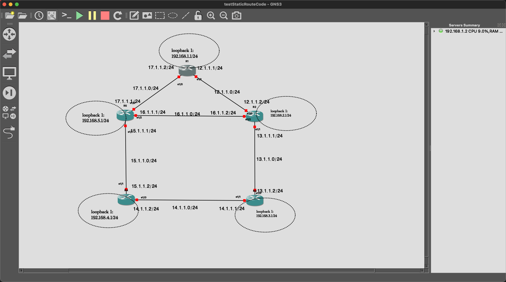
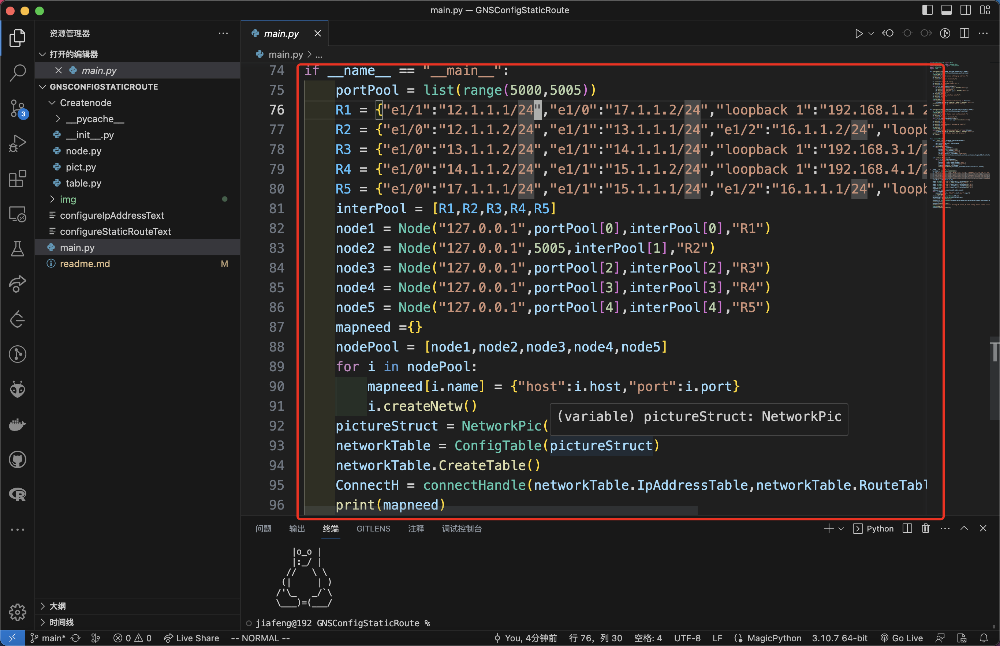
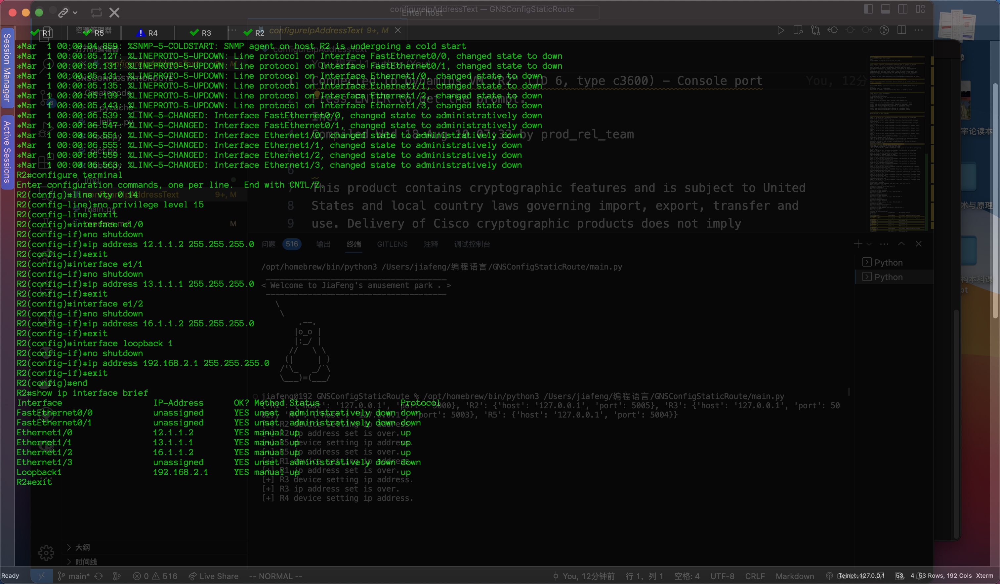
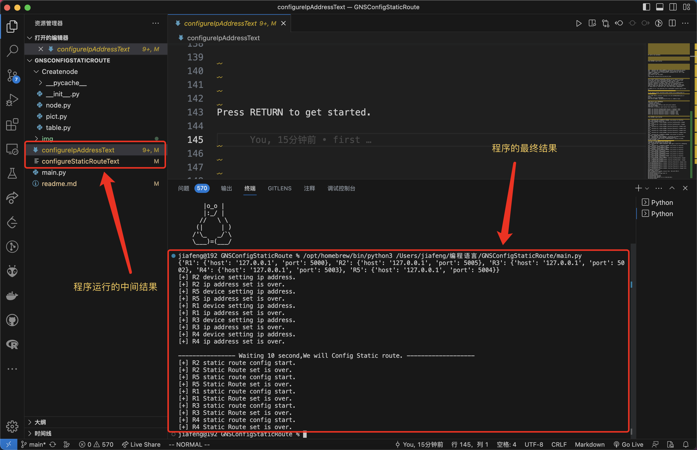

[toc]

# 项目介绍

---

这个项目的主要作用就是，可以快速的配置路由器相关的静态路由的操作。

这个项目，一开始是纯属于玩的项目，可以和`GNS3`一起搭配着使用，使用的是`python`中可以调用使用`telnet`的包。下面大致的介绍一下该项目：

> + 使用的软件：
>   + `GNS3`
>   + `vscode`
>   + `python`和`telnetlib`函数库

## 1、项目演示：

先展示一下，路由器使用的拓扑图：



下面，我们将他们全部开启，然后打开对应的代码文件：



对应的连接路由器的端口号需要再三确认，下面来看一下运行的效果：

打开，`secureCRT`，进行查看：



再看一下终端的输出情况：



## 2、代码构成：

+ 代码的结构：
  + 结点创建部分
  + 每个结点创建静态路由表
  + 路由表的结构转换
  + 配置操作


### 2.1、结点创建的代码

```python
import copy
import re
import numpy as np

def countMask(numslist):
    res = 0
    index = 7
    for i in numslist:
        res += i * (2 ** index)
        index -= 1
    return res

def convertMask(nums):
    li = []
    for i in range(nums):
        li.append(1)
    for i in range(32 - nums):
        li.append(0)
    # return "{}.{}.{}.{}".format(countMask(li[0:8]),countMask(li[8:16]),countMask(li[16:24]),countMask(li[24,32]))
    return f"{countMask(li[0:8])}.{countMask(li[8:16])}.{countMask(li[16:24])}.{countMask(li[24:32])}"
def decompose(nums,bits):
    li = []
    nums = int(nums)
    for i in range(bits):
        li.insert(0,nums % 2)
        nums = int(nums / 2)
    return np.array(li)

def countNet(ipAddress,Mask):
    ipaddresslist = re.findall("(\w+)\.",ipAddress)
    ipaddresslist.append(list(re.findall("\.(\w+)",ipAddress))[-1])
    masklist = re.findall("(\w+)\.",Mask)
    masklist.append(list(re.findall("\.(\w+)",Mask))[-1])
    res = []
    # print("len(masklist): ",len(masklist),masklist)
    for i,j in zip(ipaddresslist,masklist):
        mid = decompose(i,8) * decompose(j,8)
        mid = countMask(mid)
        res.append(mid)
    return f"{res[0]}.{res[1]}.{res[2]}.{res[3]}"

class Node:
    def __init__(self,hostname,portnumber,networkInterfaceDict,name,username=None,passwd=None):
        self.host = hostname
        self.port = portnumber
        self.user = username
        self.pasd = passwd
        self.nicd = networkInterfaceDict
        self.name = name
        self.netcard = self.createnetcard()
        self.address = {}
        self.netw = {}
        self.next = []
        self.indexnext = []

    def handleIPaddress(self):
        middleAddress = copy.deepcopy(self.nicd)
        for i,j in middleAddress.items():
            if '/' in j:
                self.address[i] = j[:-3]+ " " + convertMask(int(j[-2:]))
            else:
                a = re.findall("(\w+.\w+.\w+.\w+) (\w+.\w+.\w+.\w+)",j)
                self.address[i] = a[0][0] + " " + a[0][1]
    def createNetw(self):
        middleDict = copy.deepcopy(self.nicd)
        for i,j in middleDict.items():
            if '/' in j:
                self.netw[i] = countNet(j[:-3],convertMask(int(j[-2:]))) + " " + convertMask(int(j[-2:]))
            else:
                a = re.findall("(\w+.\w+.\w+.\w+) (\w+.\w+.\w+.\w+)",j)
                self.netw[i] = countNet(a[0][0],a[0][1]) + " " + a[0][1]
    def ShowNetwork(self):
        for i,j in self.netw.items():
            print(f"{i} --> {j}")
    
    def createnetcard(self):
        mid = []
        for i in self.nicd.keys():
            mid.append(i)
        return mid
    
    def length(self):
        return len(self.nicd)
    
if __name__ == "__main__":
    pc = {"f0/0":"192.168.1.1/24","f1/0":"192.168.2.1 255.255.255.0","loopback 1":"1.1.1.1 255.255.255.255"}
    a = Node("127.0.0.1","0",pc,"pc","Cisco","123123")
    a.createNetw()
    a.ShowNetwork()
    a.handleIPaddress()
    print(a.netcard)
```


### 2.2、创建路由表：

```python
import copy
import xml.etree.ElementTree as ET2   
from  xml.dom.minidom import Document                                                              
try:
    from Createnode.node import Node
except ModuleNotFoundError:
    from node import Node
    
class NetworkPic:
    def __init__(self,nodelist):
        self.nodes = sorted(nodelist,key=Node.length,reverse=True)
        self.length = len(self.nodes)
        self.arry = self.CreateNums()
        self.recode = []
        self.staticRoute = {}
        self.midRouteValue = []
        
    def Spanning_tree(self,iindex):
        self.recode.append(iindex)
        while len(self.recode):
            index = self.recode.pop(0)
            rootnode = self.nodes[index]
            self.arry[index] = 1
            searchTable = rootnode.netw.values()
            for i in searchTable:
                for j in range(0,self.length):
                    if(i in self.nodes[j].netw.values()) and (self.arry[j] != 1) and (j != iindex):
                        self.arry[j] = 1
                        self.recode.append(j)
                        rootnode.next.append(self.nodes[j])
                        rootnode.indexnext.append(j)
        if 0 in self.arry.values():
            print("exist alone node.")
        self.arry = self.CreateNums()
    def ShowSpanningTree(self,nodeOne):
        print(nodeOne.name,end=" ")
        if len(nodeOne.next) == 0:
            return
        sizenums = len(nodeOne.next)
        for i in range(sizenums):
            mid = nodeOne
            nodeOne = nodeOne.next[i]
            self.ShowSpanningTree(nodeOne)
            nodeOne = mid
    def treeStaticRouteTable(self,nodeOne):
        for i,j in nodeOne.netw.items():
            self.midRouteValue.append(j)
        if len(nodeOne.next) == 0:
            return
        sizenums = len(nodeOne.next)
        for i in range(sizenums):
            mid = nodeOne
            nodeOne = nodeOne.next[i]
            self.treeStaticRouteTable(nodeOne)
            nodeOne = mid
    def CreateStaticRouteTable(self,index):
        midroute = []
        nodemid = copy.deepcopy(self.nodes[index])
        i = 0
        for j in nodemid.indexnext:
            nodetest = copy.deepcopy(self.nodes[j])
            self.treeStaticRouteTable(nodetest)
            midroute.append({f"{nodemid.netcard[i]}":list(set(self.midRouteValue))})    
            self.midRouteValue.clear()
            i += 1
        self.staticRoute[f"{nodemid.name}"] = midroute
    def Treeclear(self):
        for i in self.nodes:
            i.next.clear()   
            i.indexnext.clear()
    def ClearTable(self):
        self.staticRoute.clear()
    def show(self,index):
        nodetest = copy.deepcopy(self.nodes[index])
        self.ShowSpanningTree(nodetest)
    def CreateNums(self):
        arry = {}
        for i in range(self.length):
            arry[i] = 0
        return arry
    def liftLoop(self):
        host = list(self.staticRoute.keys())[0]
        newList = {}
        for i in self.staticRoute[host]:
            nitcard = list(i.keys())[0]
            for j in i[nitcard]:
                newList[f"{j}"] = nitcard
        self.staticRoute[host] = newList
    


if __name__ == "__main__":
    pc = {"f0/0":"192.168.1.1/24","f1/0":"192.168.2.1 255.255.255.0","loopback 1":"1.1.1.1 255.255.255.255"}
    a = {"f0/0":"1.1.1.1 255.255.255.255","loopback 2":"2.2.2.2 255.255.255.255"}
    b = {"f0/1":"192.168.2.1/24","f0/0":"192.168.10.1/24"}
    c = {"loopback 1":"2.2.2.2 255.255.255.255"}
    d = {"loopback 1":"192.168.10.3/24"}
    pcnode = Node("127.0.0.1","0",pc,"pc","Cisco","123123")
    anode = Node("127.0.0.1","1",a,"a")
    bnode = Node("127.0.0.1","2",b,"b")
    cnode = Node("127.0.0.1","3",c,"c")
    dnode = Node("127.0.0.1","4",d,"d")
    li = [pcnode,anode,bnode,cnode,dnode]
    for i in li:
        # 生成各个节点的网络地址
        i.createNetw()
    pict = NetworkPic(li)
    for i in range(pict.length):
        pict.Spanning_tree(i)
        pict.CreateStaticRouteTable(i)
        pict.liftLoop()
        print(pict.staticRoute)
        pict.ClearTable()
        pict.Treeclear()
    print("\n------------------------------")
```


### 2.3、路由表的结构转换

```python
try:
    from Createnode.node import Node
except ModuleNotFoundError:
    from node import Node
    
import copy

try:
    from Createnode.pict import NetworkPic
except ModuleNotFoundError:
    from pict import NetworkPic
    
class ConfigTable:
    def __init__(self,networkNet):
        self.IpAddressTable = []
        self.RouteTable = []
        self.networkNet = networkNet
    def CreateTable(self):    
        for i in self.networkNet.nodes:
            i.handleIPaddress()
            self.IpAddressTable.append({f"{i.name}":{"host":i.host,
                                                     "port":i.port,
                                                     "interface":i.address}})
        for i in range(self.networkNet.length):
            self.networkNet.Spanning_tree(i)
            self.networkNet.CreateStaticRouteTable(i)
            self.networkNet.liftLoop()
            mid = copy.deepcopy(self.networkNet.staticRoute)
            self.RouteTable.append(mid)
            self.networkNet.ClearTable()
            self.networkNet.Treeclear()
            
if __name__ == "__main__":
    pc = {"f0/0":"192.168.1.1/24","f1/0":"192.168.2.1 255.255.255.0","loopback 1":"1.1.1.1 255.255.255.255"}
    a = {"f0/0":"1.1.1.1 255.255.255.255","loopback 2":"2.2.2.2 255.255.255.255"}
    b = {"f0/1":"192.168.2.1/24","f0/0":"192.168.10.1/24"}
    c = {"loopback 1":"2.2.2.2 255.255.255.255"}
    d = {"loopback 1":"192.168.10.3/24"}
    e = {"f0/0":"192.168.1.2/24","f1/0":"192.168.3.2/24"}
    pcnode = Node("127.0.0.1","0",pc,"pc","Cisco","123123")
    anode = Node("127.0.0.1","1",a,"a")
    bnode = Node("127.0.0.1","2",b,"b")
    cnode = Node("127.0.0.1","3",c,"c")
    dnode = Node("127.0.0.1","4",d,"d")
    enode = Node("127.0.0.1","5",e,"e")
    li = [pcnode,anode,bnode,cnode,dnode,enode]
    for i in li:
        # 生成各个节点的网络地址
        i.createNetw()
    pict = NetworkPic(li)
    
    tableOne = ConfigTable(pict)
    tableOne.CreateTable()
    for i in tableOne.IpAddressTable:
        print(list(i.values())[0]["interface"])
    print("\n-------------------- Static Route Table ------------------------")
    print(tableOne.RouteTable)
```


### 2.4、配置每一台路由器：

```python
from Createnode.node import Node
from Createnode.pict import NetworkPic
from Createnode.table import ConfigTable
import telnetlib
import time

def ConfigDevice(hostname,portnum,loopbackdict,name):
    tn = telnetlib.Telnet(host=hostname,port=portnum)
    time.sleep(15)
    print(f"[+] {name} device setting ip address. ")
    tn.write(b"\r")
    tn.write(b"configure terminal\r")
    
    tn.write(b"line vty 0 14\r")
    tn.write(b"no privilege level 15\r")
    tn.write(b"exit\r")
    for i,j in loopbackdict.items():
        tn.write(f"interface {i}\r".encode("ascii"))
        tn.write(b"no shutdown\r")
        tn.write(f"ip address {j}\r".encode("ascii"))
        tn.write(b"exit\r")
    tn.write(b"end\r")
    tn.write(b"show ip interface brief\r")
    tn.write(b"exit\r")
    tn.write(b'\r')
    time.sleep(5)
    with open("configureIpAddressText",'a') as filename:
        filename.write(tn.read_very_eager().decode("utf-8"))
    print(f"[+] {name} ip address set is over.")
    tn.close()
    
    
def ConfigStaticRoute(hostnum,portnum,staticroutedict,name):
    tn = telnetlib.Telnet(host=hostnum,port=portnum)
    time.sleep(15)
    print(f"[+] {name} static route config start. ")
    tn.write(b"\r")
    tn.write(b"configure terminal\r")
    for i,j in staticroutedict.items():
        tn.write(f"ip route {i} {j}\r".encode("ascii"))
    tn.write(b"\r")
    tn.write(b"end\r")
    tn.write(b"show running | include ip route\r")
    tn.write(b"exit\r")
    tn.write(b'\r')
    time.sleep(5)
    with open("configureStaticRouteText",'a') as filename:
        filename.write(tn.read_very_eager().decode("utf-8"))
    print(f"[+] {name} Static Route set is over.")
    tn.close()
    
    
class connectHandle:
    def __init__(self,iptable,statictable,mape):
        self.ipaddress = iptable
        self.staticaddress = statictable
        self.mapp = mape
    def setIPaddress(self):
        for i in self.ipaddress:
            pcname = list(i.keys())[0]
            hostname1 = i[pcname]["host"]
            portname1 = i[pcname]["port"]
            interfaceDict1 = i[pcname]["interface"]
            ConfigDevice(hostname=hostname1,portnum=portname1,loopbackdict=interfaceDict1,name=pcname)
            
    def setStaticRoute(self):
        for i in self.staticaddress:
            pcname = list(i.keys())[0]
            hostname1 = self.mapp[pcname]["host"]
            portname1 = self.mapp[pcname]["port"]
            staticroutedict1 = i[pcname]
            ConfigStaticRoute(hostname1,portname1,staticroutedict1,pcname)
            
if __name__ == "__main__":
    portPool = list(range(5000,5005))
    R1 = {"e1/1":"12.1.1.1/24","e1/0":"17.1.1.2/24","loopback 1":"192.168.1.1 255.255.255.0"}
    R2 = {"e1/0":"12.1.1.2/24","e1/1":"13.1.1.1/24","e1/2":"16.1.1.2/24","loopback 1":"192.168.2.1/24"}
    R3 = {"e1/0":"13.1.1.2/24","e1/1":"14.1.1.1/24","loopback 1":"192.168.3.1/24"}
    R4 = {"e1/0":"14.1.1.2/24","e1/1":"15.1.1.2/24","loopback 1":"192.168.4.1/24"}
    R5 = {"e1/0":"17.1.1.1/24","e1/1":"15.1.1.1/24","e1/2":"16.1.1.1/24","loopback 1":"192.168.5.1/24"}
    interPool = [R1,R2,R3,R4,R5]
    node1 = Node("127.0.0.1",portPool[0],interPool[0],"R1")
    node2 = Node("127.0.0.1",5005,interPool[1],"R2")
    node3 = Node("127.0.0.1",portPool[2],interPool[2],"R3")
    node4 = Node("127.0.0.1",portPool[3],interPool[3],"R4")
    node5 = Node("127.0.0.1",portPool[4],interPool[4],"R5")
    mapneed ={}
    nodePool = [node1,node2,node3,node4,node5]
    for i in nodePool:
        mapneed[i.name] = {"host":i.host,"port":i.port}
        i.createNetw()
    pictureStruct = NetworkPic(nodePool)
    networkTable = ConfigTable(pictureStruct)
    networkTable.CreateTable()
    ConnectH = connectHandle(networkTable.IpAddressTable,networkTable.RouteTable,mape=mapneed)
    print(mapneed)
    ConnectH.setIPaddress()
    print("\n---------------- Waiting 10 second,We will Config Static route. -------------------")
    time.sleep(10)
    ConnectH.setStaticRoute()
```

